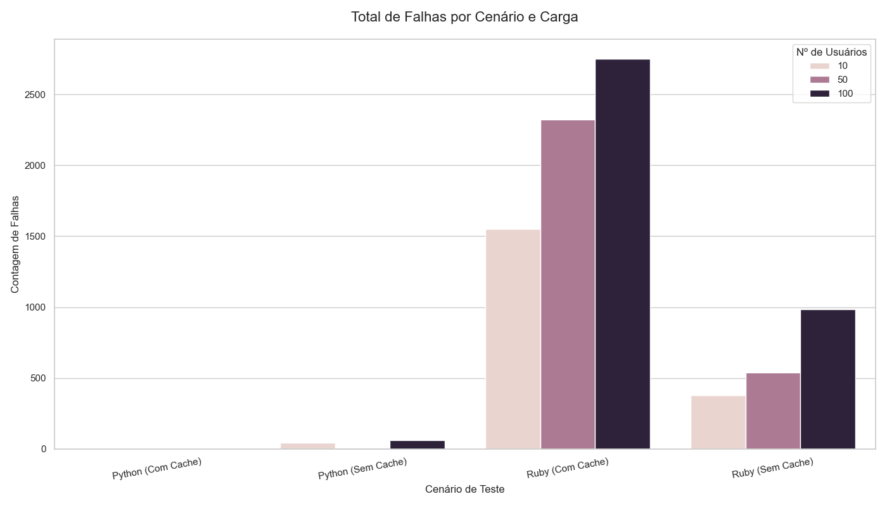
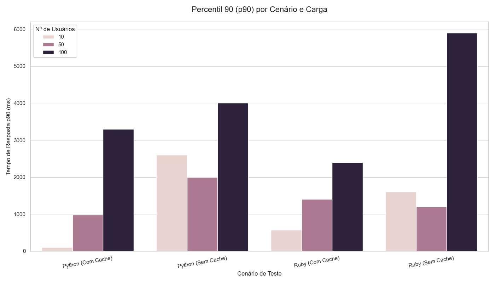
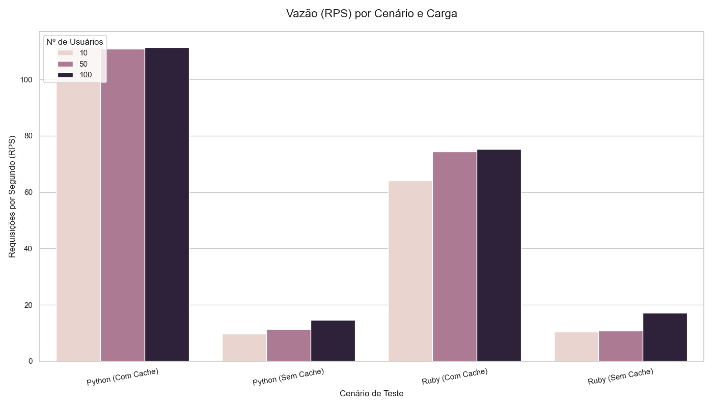

# Relatório de Teste de Desempenho: Link Extractor

Este repositório contém os **scripts, dados e resultados** dos testes de desempenho da aplicação **"Link Extractor"**.  
O objetivo foi **comparar o desempenho** de duas versões da API (**Python e Ruby**) sob diferentes condições de carga e uso de cache.

---

## Ferramentas Utilizadas

- **Docker & Docker Compose:** Para conteinerizar e orquestrar os ambientes de teste.  
- **Locust:** Para a geração de carga (usuários virtuais) via script.  
- **Python (Pandas, Matplotlib, Seaborn):** Para compilar e visualizar os dados de resultado.

---

## Testando a API Python (Ambiente `step5`)

### A. Python com Cache

Este cenário testa o desempenho da **API Python com o cache Redis totalmente operacional.**

**Entrar na pasta do ambiente:**
```bash
cd step5/
```

**Subir os contêineres (API + Web + Redis):**
```bash
docker-compose up -d --build
```

**(Opcional) Monitorar o Cache (Hit/Miss):**
```bash
docker-compose exec redis redis-cli monitor
```

**Executar o Teste de Carga (Locust):**
```bash
locust -f locustfile.py --host=http://localhost:5000
```

### B. Python Sem Cache

Para simular o cenário "Sem Cache", o arquivo step5/api/main.py foi modificado para sempre realizar o scraping (100% Cache Miss), ignorando o Redis.
Os comandos para subir o ambiente e rodar o Locust foram os mesmos do cenário “Com Cache”.

```python
@app.route("/api/<path:url>")
def api(url):
    # A verificação de cache foi removida (comentada)
    # jsonlinks = redis_conn.get(url) 
    # if not jsonlinks: 
    
    # O scraping agora acontece em TODAS as requisições
    links = extract_links(url)
    jsonlinks = json.dumps(links, indent=2)
    
    # O salvamento no cache foi removido (comentado)
    # redis_conn.set(url, jsonlinks) 
    
    return jsonlinks
```


## Testando a API Ruby (Ambiente `step6`)

### A. Ruby com Cache

Este cenário testa o desempenho da **API Ruby com o cache Redis totalmente operacional.**

**Entrar na pasta do ambiente:**
```bash
cd step6/
```

**Subir os contêineres (API + Web + Redis):**
```bash
docker-compose up -d --build
```

**(Opcional) Monitorar o Cache (Hit/Miss):**
```bash
docker-compose exec redis redis-cli monitor
```

**Executar o Teste de Carga (Locust):**
```bash
locust -f locustfile.py --host=http://localhost:4567
```

### B. Ruby Sem Cache

Similar ao Python, o arquivo step6/api/linkextractor.rb foi modificado para sempre realizar o scraping.
Os comandos para rodar o ambiente foram os mesmos.

Modificação no código (step6/api/linkextractor.rb):

```ruby
get "/api/*" do
  url = [params['splat'].first, request.query_string].reject(&:empty?).join("?")
  
  # Verificação de cache comentada
  # cache_status = "HIT" 
  # jsonlinks = redis.get(url) 
  # if jsonlinks.nil? 
  #   cache_status = "MISS"
  
  # O scraping agora acontece em TODAS as requisições
  jsonlinks = JSON.pretty_generate(extract_links(url))
  
  # Salvamento no cache comentado
  #   redis.set(url, jsonlinks) 
  # end

  # Log de cache comentado (para evitar erros de variável)
  # cache_log.puts "#{Time.now.to_i}\t#{cache_status}\t#{url}"

  status 200
  headers "content-type" => "application/json"
  body jsonlinks
end

```

## Observações sobre os Testes do Ruby
Durante a execução dos testes, a API em Ruby apresentou instabilidade.

- No cenário "Com Cache", houve uma taxa de falha de aproximadamente 20% (Erros 500).
- No cenário "Sem Cache", a taxa de falha foi ainda maior, indicando que a API Ruby (ou suas dependências, como open-uri) não lidou bem com a carga de requisições de scraping ou com redirecionamentos HTTPS das URLs de teste.
- Em comparação, os testes da API Python rodaram com 0% de falhas em todos os cenários.

## Análise e Visualização (Resultados)
- Pasta Resultados


